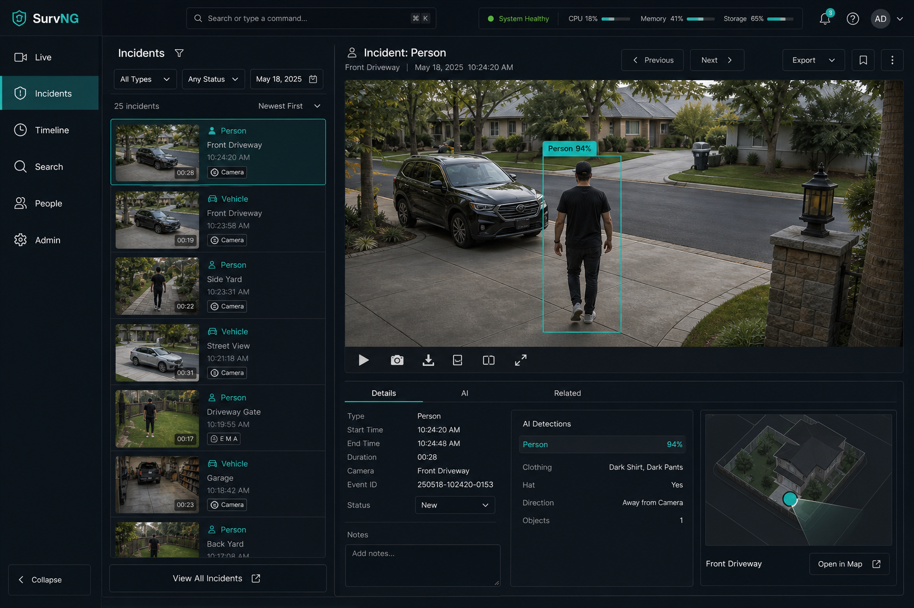

# Incidents

**Incidents** answers: what important activity did SurvNG keep?

An incident is more than a motion blink. It is a stretch of activity with evidence you can inspect — usually a picture, object labels when detection is on, and links into recorded video.

## Browse incidents

Use filters to narrow the list:

- Camera
- Object label (person, car, and so on)
- Zone
- Source or time range

Open an incident to see:

- The representative snapshot
- Labels and confidence SurvNG assigned
- Related activity nearby in time
- Actions to jump into Timeline at the same moment

## Focus vs mosaic

Incidents can show one primary piece of evidence at a time (**Focus**) or a denser mosaic of thumbnails. Pick whichever helps you review faster; SurvNG remembers the preference for the session.

## Progressive pictures

Snapshots often load a lighter preview first, then a sharper original when you zoom. That keeps browsing responsive on slower links.

## Thumbnail object crop

Under **Admin → Storage**, you can crop compact incident thumbnails to detected objects:

- **Off** keeps the full frame (default)
- **Auto crop** zooms thumbnails to the object union
- **Manual crop button** shows a crop control on cards that support it

**Object focus zoom** (1.0–5.5) tightens that crop. Detection-box overlays are a separate checkbox and do not need to be on for crop/zoom.

Focused thumbnails request a higher-resolution raster (and fall back to the stored snapshot when needed). Zoom is also capped so SurvNG does not magnify past the pixels available for the object — distant tiny detections stay softer than close ones, but without empty blur.

## Clean, AI, and tracks

Depending on what SurvNG stored for the incident, you may switch between:

- A clean picture
- Annotated detection overlays
- Track playback when object tracking produced a path

## Example review flow

1. Open **Incidents**.
2. Filter to `Front Door` and object `person`.
3. Open the latest incident.
4. Confirm the picture matches what you expect.
5. Choose **View in Timeline** to watch the surrounding video.
6. If face recognition is enabled, check whether a person suggestion appeared under **People**.

## What is not an incident

**Motion Audit** (in Admin) stores diagnostic samples that did **not** become incidents. Use it when tuning sensitivity — not as your daily event list.

## Related

- [Motion & detection](motion-detection.md)
- [Timeline & exports](timeline.md)
- [AI assistant](assistant.md)
- [People](people.md)
