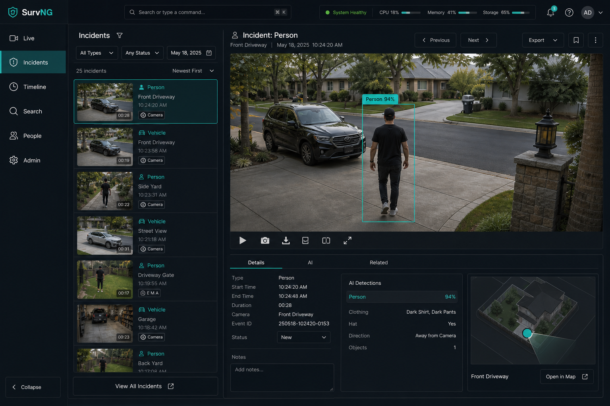

# Incidents

**Incidents** answers: what happened, who or what was present, and which camera views belong together?

An incident contains a complete inventory of observed objects across its camera episodes. Objects remain included when they are stationary, in an Ignore zone, uncertain, or absent from the cover image. Notification rules control alerts separately. Turning notifications off for an incident zone does not stop that zone from creating an incident.

A detector observation does not, by itself, establish an incident. Periodic
discovery first retains observations, then checks surrounding recorded frames for
physical activity. Zones then decide whether that activity can open or prolong
an incident. Activity that is only inside an enabled Ignore zone does not.
Activity in an eligible zone on the same camera does, and the incident still
contains the rest of that camera episode, including ignored objects. A camera
or motion notice needs a detection in an eligible zone when Ignore zones or
required incident zones are configured; the notice alone is not enough. The
incident explains which evidence established it, separately from why an alert
was sent.

## Browse incidents

Use filters to narrow the list:

- Camera
- Object label (person, car, and so on)
- Zone
- Source or time range

Open an incident to see:

- The representative snapshot
- All observed objects, their visible intervals, and supporting evidence
- Camera episodes and analysis coverage
- Corrections for labels, object associations, and incident boundaries
- Related activity nearby in time
- Actions to jump into Timeline at the same moment

## Focus vs mosaic

Incidents can show one primary piece of evidence at a time (**Focus**) or a denser mosaic of thumbnails. Pick whichever helps you review faster; SurvNG remembers the preference for the session.

## Progressive pictures

Snapshots often load a lighter preview first, then a sharper original when you zoom. That keeps browsing responsive on slower links.

## Thumbnail object focus

Under **Admin → Storage**, you can crop compact incident thumbnails to detected objects:

- **Off** keeps the full frame (default)
- **Auto** crops thumbnails to the object union
- **Manual button** shows a focus control on cards that support it

**Object focus zoom** (0.25–5.5) tightens or loosens that crop. `1` fits objects with padding; values below `1` show more context (useful for distant tiny detections); values above `1` zoom tighter. Detection-box overlays are a separate checkbox and do not need to be on for focus/zoom.

Focused compact thumbnails are cropped from the **full-resolution snapshot on the server**, then resized near the tile size — so the client downloads a small crop instead of a large full-frame JPEG. Padding favors showing the full subject (head/feet often sit outside detection boxes). The crop expands with background to match the tile aspect (16:9 in lists, 16:10 in card previews) so tiles stay uniform without letterboxing. Expanded viewers can still use CSS focus when a manual button is shown. Zoom is capped so SurvNG does not over-crop distant detections into empty blur.

## Clean, AI, tracks, and depth

Depending on what SurvNG stored for the incident, you may switch between:

- A clean picture
- Annotated detection overlays
- Track playback when object tracking produced a path
- **Depth** replay when monocular depth is configured

Depth replay runs object detection and depth estimation over the incident clip.
Choose **Both**, **Boxes**, or **Heatmap** to show distance-labeled boxes, the
depth heatmap, or both. Stored object badges may also show an estimated distance
when representative-frame depth enrichment was available. These values are
monocular estimates; use them as scene context rather than precise measurements.

## Example review flow

1. Open **Incidents**.
2. Filter to `Front Door` and object `person`.
3. Open the latest incident.
4. Confirm the picture matches what you expect.
5. Choose **View in Timeline** to watch the surrounding video.
6. If face recognition is enabled, check whether a person suggestion appeared under **People**.

## What is not an incident

**Observations**, linked from incident review, keeps candidates awaiting confirmation,
activity that could not be established, and incomplete analysis. Movement that
stays in an Ignore zone is retained there without becoming an incident, and it
does not keep an otherwise finished incident open. Missing video or
busy inference capacity means the result is unresolved. Low-confidence detections
remain available here and in any incident whose scene contains them.

Some historical records have no retained evidence that establishes activity.
Their old links still open the preserved record with that limitation explained;
they are no longer listed as established incidents.

**Motion Audit** (in Admin) stores diagnostic samples that did **not** become incidents. Use it when tuning sensitivity — not as your daily event list.

## Related

- [Motion & detection](motion-detection.md)
- [Timeline & exports](timeline.md)
- [AI assistant](assistant.md)
- [People](people.md)

## Scene history and corrections

The observed-object inventory stays the same while you select different frames.
Possible detections are labelled uncertain; detector confidence is available in
evidence details. “No supporting image” or incomplete coverage does not mean an
object was absent. Historical incidents contain the observations that were still
retained at migration time.

An administrator can correct an object label, associate observations of the same
object, separate a mistaken association, or merge/split camera episodes. Changes
preserve original observations and old incident links. If evidence changes while
you are editing, refresh before retrying the correction.

Periodic discovery looks for activity even without a camera notice. It samples
within the configured inference capacity; unchanged scene objects do not create
an endless sequence of incidents.
