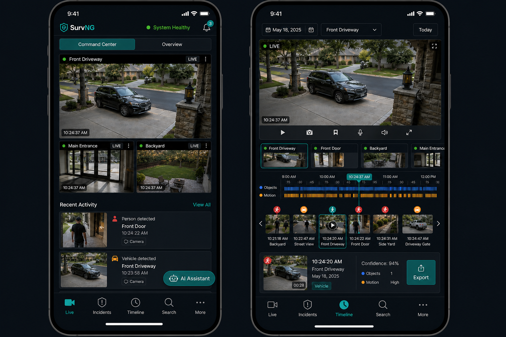

# Live view

**Live** answers one question: what is happening on my cameras right now?

## What you see

- A grid of camera tiles with live or near-live video
- Borders or cues when a camera has recent motion
- A feed of recent incidents so you can jump from “now” to “what just happened”

On a phone, SurvNG keeps the same ideas in a more compact layout.

## Command Center and Overview

Live includes two ways to arrange cameras:

- **Command Center** — denser monitoring layout for day-to-day watching
- **Overview** — alternate layout for scanning many cameras

Both stay inside Live; they are not separate destinations in the main navigation.

## Useful controls

- Select a camera tile to focus on it
- Switch between main and sub preview when both streams exist
- Open a recent incident from the side feed without leaving the monitoring mindset

Live presentation settings (cropping/framing) only change how the browser shows the picture. They do **not** crop recordings, detection, or exports.

## Tips

1. Start with one or two important cameras before filling the grid.
2. Prefer the sub stream for live watching when the picture is still clear enough — it is lighter on the network.
3. If a tile shows a still image instead of moving video, SurvNG may be waiting on a stream reconnect; check Admin health and the camera’s network path.

## Related

- [Cameras](cameras.md)
- [Incidents](incidents.md)
- [Admin](admin.md)
