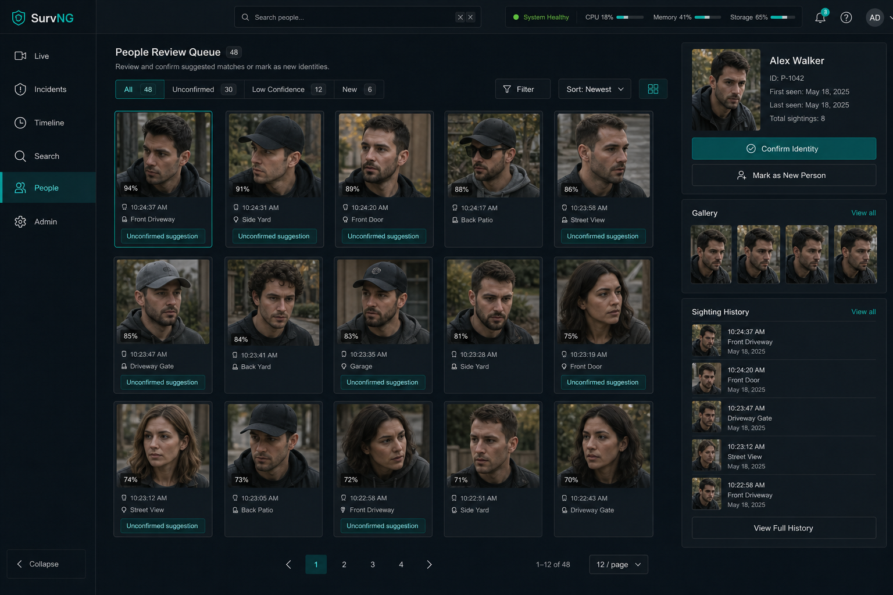

# People

**People** answers: who was seen?

When people identity is enabled, SurvNG fuses **face** embeddings with
**whole-body** appearance (person ReID) to recognize named people. Face evidence
is strongest when available. Body evidence keeps identity useful when the face
is small, blurred, profile, or briefly missing. Tracking ReID remains separate:
track continuity is not the same as a named person record.

## First-time setup

1. Install the face model package and enable person ReID on the server.
2. Enable recognition under **Admin → Detection → People Identity**.
3. Confirm face embedding/landmark/detector paths.
4. Enable person ReID under **Tracking & ReID** and point it at the person
   ReID model (`person-reidentification-retail-0286` by default; OSNet-class
   person models are preferred when available).
5. Wait for incidents that include people with usable face and/or body evidence.

Distant blobs and heavy motion blur still make faces hard. Body appearance can
still produce a **suggestion**, but SurvNG will not auto-identify from body
alone because clothing changes and lookalikes are common.

## How matching works

- **Face** comparisons use ArcFace embeddings from clear face crops.
- **Body** comparisons reuse durable person ReID vectors linked by the parent
  person track on the same incident.
- **Fused** matches require face and body to agree on the same person.
- Face/body disagreement with similar scores produces no suggestion.
- Automatic identification requires a strong face match, or a fused agreement
  that clears higher thresholds. Body-only matches stay reviewable.

## Review queue

New matches usually appear as suggestions. Confirm good matches so SurvNG can
build a trusted gallery for that person. Automatic identification, if enabled,
still keeps a high bar and does not silently teach the gallery from unverified
guesses.

## Naming a person

1. Open **People**.
2. Review an unknown cluster or suggestion.
3. Create or select a person record.
4. Confirm the best reference images.

Pin an especially clear face reference when you have one. SurvNG also retains
confirmed body references for later fusion. Quality-weighted, camera-diverse
galleries beat simply keeping the newest crop.

## Example

A neighbor’s regular walker keeps appearing at the sidewalk:

1. Open the latest porch incident and note the identity suggestion.
2. In **People**, confirm several clear crops of the same person.
3. Name the person `Alex Walker`.
4. Later visits can match on face when clear, or body appearance when the face
   is weak, and remain reviewable until confirmed.

## Privacy note

People identity data stays on your SurvNG installation. Treat People records as
sensitive household or workplace information.

## Related

- [Incidents](incidents.md)
- [AI assistant](assistant.md)
- [Admin](admin.md)
