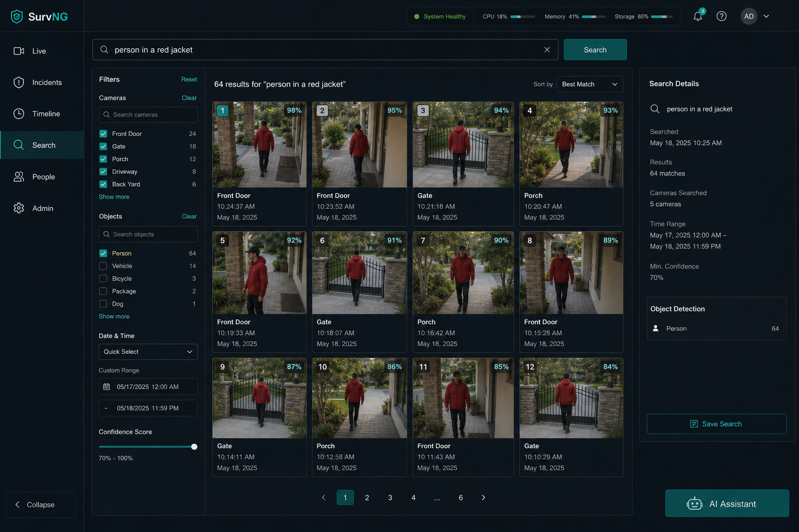

# Search

**Search** answers: where did matching activity appear?

SurvNG supports ordinary incident filters and, when enabled, **Smart Search** —
find incidents from a short visual description — plus **Find similar**, which
starts from a clicked object in an incident snapshot.

## Filters

Even without Smart Search you can narrow incidents by camera, object label,
zone, and time. That is often enough for “show me cars at the gate yesterday.”

## Smart Search (optional)

Smart Search compares your text to pictures SurvNG already stored. Images and
search indexes stay on your SurvNG host. They are not uploaded to the AI
assistant provider.

### Example queries

- `person in a red jacket`
- `white delivery truck`
- `dog near the fence`
- `package on the porch`

Concrete visual phrases work best. Abstract ideas (“suspicious,” “threat”)
match poorly because the search compares appearance, not intent.

### Find similar (object crop)

On an expanded incident, select a detection box or use **Find similar** in the
incident details panel. SurvNG:

- uses **appearance / ReID** first for person and vehicle tracks when available
- broadens with **visual crop similarity** (Smart Search image index)
- tags each result as Appearance or Visual (scores are not fused)

Results are hypotheses, not proof of the same physical item. Timeline links
open the matching camera and event time.

Details and roadmap: [Forensic visual search](../forensic-visual-search.md).

### Setup summary

1. Build or install the Smart Search model package.
2. Enable Smart Search under **Admin → Detection**.
3. Allow SurvNG time to index existing incident pictures.
4. Open **Search**, type a description, and review the ranked results — or
   click an object on an incident and choose **Find similar**.

Details for model packages: [Smart Search model packages](../semantic-search.md).

## Tips

- Combine a text query with a camera filter when you already know where to look.
- If results look random, the index may still be warming up, or the model
  package may be missing.
- Smart Search finds object incidents with pictures; it is not a full-text
  search of filenames.
- Find similar searches the same incident index, not every frame of continuous
  recordings.

## Related

- [Incidents](incidents.md)
- [Admin](admin.md)
- [HTTP API](api.md) (`POST /api/semantic-search`, `POST /api/semantic-search/visual`)
- [Forensic visual search](../forensic-visual-search.md)
