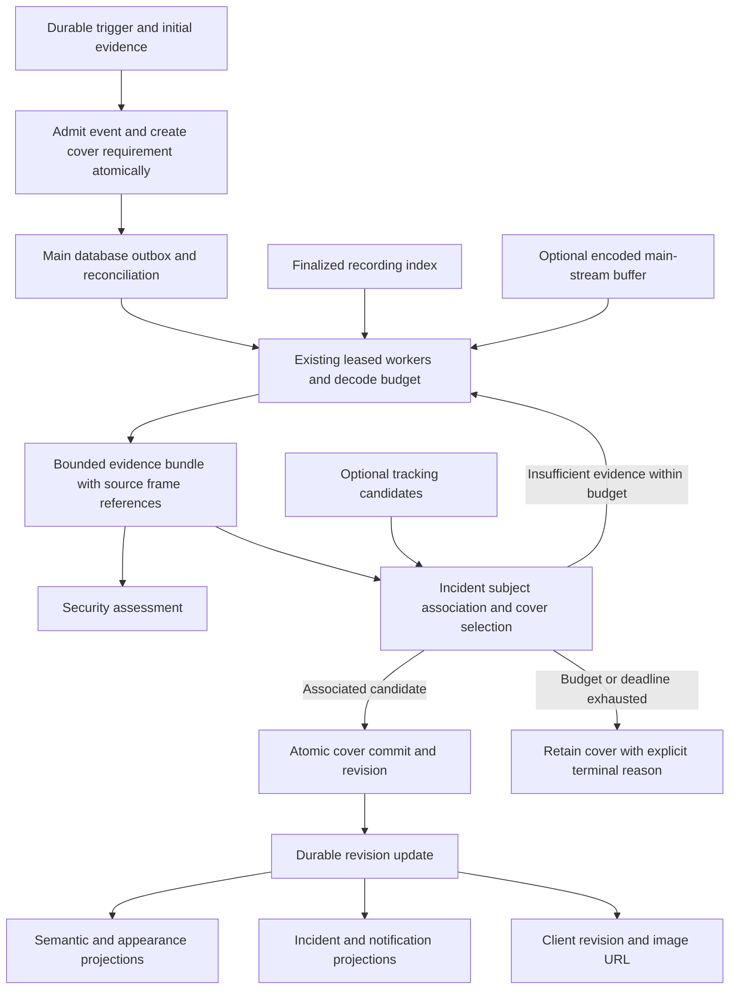
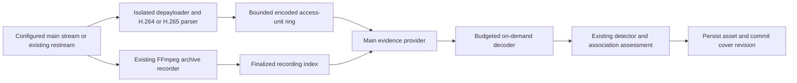

**Incident evidence pipeline architecture review — September 13, 2026**

The recommended change is an event-owned evidence workflow with an independently
tracked cover requirement and one revisioned cover-commit boundary. Keep the
existing capture, recording index, detector workers, decode budgets, and SQLite
databases. The separation between admission, attribution, and presentation is
already stated in `incident-evidence-data-path.md`; the executable state and
completion contracts do not consistently enforce it.

The proposal also adds an optional encoded main-stream buffer and an on-demand
frame reader. This makes recent high-resolution evidence available before an
archive segment closes. The buffer feeds the same evidence workflow and cover
commit; finalized recordings remain its durable fallback. Reliability and
earlier media access are separate changes with separate acceptance gates.

The investigation below records the pre-change architecture; the implementation
status at the end describes the subsequent changes and remaining rollout gates.
The investigation examines repository baseline `c886f75`, the running service through its
owner-only observability socket, persisted incident/job/index rows through
read-only SQLite connections, saved image headers, and focused reproductions.
Three expert agents were explicitly launched with `gpt-6-astra`, covering
lifecycle/durable work, recorded evidence/video selection, and storage/client
consistency. The primary session's model identifier is not exposed for
verification. No production data, application code, or service configuration was
changed by this review.

The early-media-access extension below was added after the latency discussion,
with integration points checked at `a5dcb1a`. The Astra video expert reviewed
codec dependencies, timestamps, buffering and failure isolation. Its budgets
and latency gates are proposals for measurement, not implemented settings or
benchmark results.

**What the reported incident establishes**

Back-Right at **2026-09-13 16:04:47 EDT** is event **70028**, timestamp
`2026-09-13T20:04:47.218516+00:00`.

| Boundary | Observed result |
| --- | --- |
| Initial evidence | An eligible provisional person and a saved 640×366 live image. |
| Durable work | Refinement created at 20:04:47.437376 UTC; completed at 20:05:00.313901 UTC, one attempt. |
| Main recording | A saved 4512×2512 image exists; obtaining high-resolution pixels succeeded. |
| Sampling | Three frames requested and decoded from a 16-offset plan, one batch, no fallback samples. |
| Time spent | 7,995.719 ms recording wait; 104.390 ms detector requests; 9,471.194 ms provider workflow. |
| Attribution | Two eligible person candidates; both rejected under stationary-spatial accounting. |
| Cover fallback | `refinement_cover_not_eligible`; the original image remained selected. |
| Completion | `object_detected=false`, `object_not_motion_correlated`, `refinement_pending=false`, job completed, `handoff_completed=true`. |

The saved outcome does not contain the rejected candidates' complete geometry
and per-candidate provenance. It therefore cannot establish which exact
cover-eligibility predicate failed, or whether the two person candidates were
both visible in the selected image. The earlier suspicion of same-label
ambiguity remains unproven. Likewise, stationary-spatial accounting describes
the policy result, not proof that the person did not cause motion.

A bounded cohort inspection read the image headers for **533 stored motion
events dated September 13 UTC**. **529 had images larger than 896 pixels on their
longest side; four retained small images.** These are event rows, not grouped UI
incidents, and this UTC interval is not the local calendar day. All four had
eligible provisional labels and completed negative refinement outcomes:

| Event | Camera | UTC timestamp | Saved dimensions | Refined outcome |
| --- | --- | --- | --- | --- |
| 70028 | Back-Right | 20:04:47 | 640×366 | `object_not_motion_correlated`; cover fallback declined |
| 70013 | Back-Right | 19:57:47 | 640×366 | `no_eligible_object` |
| 69916 | Foyer | 13:48:35 | 640×480 | `no_eligible_object` |
| 69517 | Foyer | 00:09:37 | 640×480 | `no_eligible_object` |

This measures retained image state during inspection, not how often browsers
displayed stale images. The browser contract has a separate defect below.

**Current ownership and where it breaks down**

| Stage | Current owner and useful protections | Architectural issue |
| --- | --- | --- |
| Camera/EMA ingress | Ingress normalizes timing; episode/intent authority preserves source and generation. Durable trigger delivery precedes memory wakeup. | These protections should remain; no new ONVIF or trigger-admission defect was established for this incident. |
| Initial evidence/admission | Fresh qualified live pixels, initial detector workload, intent-deduplicated event insertion. | Event insertion and refinement-job insertion are separate commits. An event does not atomically acquire its own durable cover requirement. |
| Main recording readiness | Indexed playable recordings, background edge refresh, actual decoded PTS on the batch path. | Waiting and availability are embedded in detection execution. Approximate fallback timestamps have a weaker contract than batch timestamps. |
| Temporal analysis | Shared workers, staged sampling, confirmation, image quality selection. | The sampler's stopping decision precedes the downstream attribution decision. |
| Admission/attribution | Confidence, zones, activity, and causal correlation in the decision handler. | A later rejection can terminate the workflow even though an existing incident still lacks its cover. |
| Cover writes | Accepted refinement, guarded presentation fallback, optional tracking promotion. | Different writers have different eligibility, geometry, and downstream-update behavior. |
| Tracking/face work | Optional handoff, exact-reference tracking cover checks, bounded enrichment. | Tracking is neither guaranteed to start nor guaranteed to increase image resolution. Face completion can remain implicit on rejection paths. |
| Derived views | Manager callbacks refresh incident state, semantic/appearance indexes, notifications, and clients. | Update semantics depend on producer/event type; image revisions are not shared consistently across storage, indexes, and clients. |

Useful existing foundations include durable trigger delivery and intent
deduplication, preservation of provisional evidence on transient failures,
checkpointed refinement results, delayed completion replay, atomic guarded
cover updates, and shared inference admission. The redesign should retain them.
Sources: [trigger delivery](/root/SurvNG/survng/app/motion_events.py:399),
[intent deduplication](/root/SurvNG/survng/app/event_store/store.py:336),
[refinement checkpoints](/root/SurvNG/survng/app/motion_incidents.py:1086).

**Findings, ordered by architectural consequence**

1. **There is no durable contract for finishing an admitted event's cover.**
   A recorded security decision can correctly become terminal without supplying
   a usable cover. The current workflow has nowhere independent to retain that
   remaining requirement. Fallback promotion runs only for
   `object_not_motion_correlated`; `no_eligible_object` bypasses it. A declined
   promotion or even a promotion exception can still lead to job completion.
   This is the common boundary across all four retained low-resolution cases.
   Retrying every negative security result would mix the responsibilities again.
   Sources: [fallback gate](/root/SurvNG/survng/app/motion_pipeline/decision_handler.py:861),
   [job completion](/root/SurvNG/survng/app/motion_incidents.py:1135).

2. **Sampling cannot respond to the decision that needs its evidence.**
   The adaptive core can stop after offsets `0,+0.5,-0.5` confirm objects and
   satisfy representative-image criteria. Motion attribution runs afterward.
   Two observations count as temporal evidence without a minimum elapsed
   observation duration; spatial fallback is disabled once temporal evidence
   is present. A short sequence with little bounding-box-center movement can
   therefore reject an object that the live spatial check admitted. There is no
   `insufficient_evidence → request next bounded stage` feedback contract.
   Pausing or moving limbs within a stable box are relevant test scenarios,
   not established explanations of 70028. Sources:
   [adaptive core](/root/SurvNG/survng/app/motion_pipeline/object_detection.py:1855),
   [sampling return](/root/SurvNG/survng/app/motion_pipeline/object_detection.py:2005),
   [temporal availability](/root/SurvNG/survng/app/object_motion.py:33),
   [spatial fallback](/root/SurvNG/survng/app/motion_pipeline/decision_handler.py:159),
   [later attribution](/root/SurvNG/survng/app/motion_pipeline/decision_handler.py:822).

3. **Worker completion and actual follow-up work are conflated.**
   Initial tracking is deferred when refinement is queued or coalesced and the
   worker is accepting work. Exceptions
   and unavailable results fall back to initial-evidence handoff; a terminal
   negative does not. The worker calls `_handoff` with the negative result, then
   records `handoff_completed=true` regardless of the returned Boolean. An
   isolated reproduction produced **zero tracking-start calls, a completed job,
   and `handoff_completed=true`**. This establishes that the flag is not evidence
   tracking started; it does not exclude other independent tracking paths for
   a historical event. Tracking should remain optional, with an explicit
   disposition such as started, declined, not applicable, or failed.
   Sources: [deferred handoff](/root/SurvNG/survng/app/motion_incidents.py:733),
   [handoff guard](/root/SurvNG/survng/app/motion_incidents.py:760),
   [unavailable fallback](/root/SurvNG/survng/app/motion_incidents.py:1068),
   [unconditional checkpoint](/root/SurvNG/survng/app/motion_incidents.py:1095).

4. **Image versioning is broken across the API/client boundary.**
   The presenter sanitizes every real snapshot path to the constant `available`.
   The frontend uses that field as its image cache version. Calling the actual
   presenter and URL functions for different image paths yielded the same
   `/api/events/70028/snapshot.jpg?v=available` and the same thumbnail URL.
   Snapshots allow one hour of caching; thumbnails allow one day with
   `immutable`. Updated annotations can consequently appear with cached older
   pixels. This is a reproduced integration-contract defect; a browser session
   was not exercised. Sources:
   [sanitization](/root/SurvNG/survng/app/incident_presenter.py:24),
   [URL version](/root/SurvNG/frontend/src/shared/mediaUrls.js:3),
   [snapshot cache](/root/SurvNG/survng/app/appearance_routes.py:337),
   [thumbnail cache](/root/SurvNG/survng/app/appearance_routes.py:427).

5. **Different cover writers invalidate derived evidence differently.**
   Accepted refinement publishes `object`; the manager calls semantic
   `queue_event`. Presentation-only promotion uses `incident_update`, which
   calls `refresh_event`. The former checks whether a full-frame embedding
   already exists for the event/model/source, without including the changed
   image; the latter deletes old rows before reindexing. Read-only inspection
   found **89 events dated September 13 UTC whose retained full-frame semantic
   row references a different image from the event's current snapshot**.
   Events 70044, 70045, and 70046 have different filenames, so those examples
   are not relative/absolute path aliases. The count covers retained index rows;
   active-model search behavior was not replayed. Sources:
   [refinement publish](/root/SurvNG/survng/app/motion_pipeline/decision_handler.py:1060),
   [refresh path](/root/SurvNG/survng/app/manager.py:1608),
   [queue path](/root/SurvNG/survng/app/manager.py:1677),
   [refresh semantics](/root/SurvNG/survng/app/semantic_search.py:1593),
   [existing full-frame check](/root/SurvNG/survng/app/semantic_search.py:1667).

6. **Presentation provenance is encoded as mutable object dictionaries.**
   The fallback promoter accepts candidates marked `snapshot_visible=false`,
   then installs their boxes as visible on the selected frame. A reproduction
   using the real method with an in-memory database promoted a sole off-frame
   candidate and flipped its visibility to true. This is a concrete geometry
   defect. Multiple same-label tracks across a temporal window are separately
   an identity-ambiguity policy question; simply ignoring all off-frame tracks
   would not establish which subject matches the original incident. Original
   observation coordinates and cover annotation coordinates need distinct
   records tied to their own frame references. Both promotion paths also
   overwrite boxes/dimensions without replacing an existing `mask_polygon`,
   which the presenter exports. A detection with a mask can therefore retain
   an old-image polygon after its box moves to new pixels. Sources:
   [candidate filter](/root/SurvNG/survng/app/event_store/store.py:1069),
   [presentation mutation](/root/SurvNG/survng/app/event_store/store.py:1159),
   [off-frame temporal evidence](/root/SurvNG/survng/app/motion_pipeline/object_detection.py:1077),
   [tracking geometry mutation](/root/SurvNG/survng/app/event_store/store.py:971),
   [exported mask](/root/SurvNG/survng/app/incident_presenter.py:189).

7. **Tracking-based improvement can preserve the low resolution.**
   Tracking cover selection seeks better composition: a later exact frame,
   adequate framing, and a materially larger subject-area ratio. It is not a
   general resolution-upgrade contract. Moreover, the seed's coordinate width
   becomes the maximum cover decode width. A session seeded at 640 pixels can
   extract a main-recording cover capped at 640 pixels. Separate coordinate
   geometry, inference working size, and stored cover resolution. Sources:
   [composition gates and decode call](/root/SurvNG/survng/app/object_track/session.py:498),
   [seed geometry](/root/SurvNG/survng/app/object_track/session.py:892),
   [decode cap](/root/SurvNG/survng/app/tracking_frames.py:584).

8. **Durability is constrained by mismatched lease/freshness policies.**
   Event-bound work has a default 60-second creation-age limit and a 60-second
   lease. After a crash, a different owner must wait for lease expiry; by then,
   uncheckpointed work is old enough for stale-job expiry, which runs before
   reclaim. Checkpointed results have a separate completion window and fare
   better. This is a policy defect for recovering unfinished event evidence,
   not evidence that 70028 crashed. Event insertion and job admission also span
   two databases; durable trigger replay mitigates that crash window without
   making an event-owned requirement atomic. Sources:
   [age limits](/root/SurvNG/survng/app/event_store/jobs.py:12),
   [claim and expiry ordering](/root/SurvNG/survng/app/event_store/jobs.py:659),
   [stale transition](/root/SurvNG/survng/app/event_store/jobs.py:787),
   [separate databases](/root/SurvNG/survng/app/event_store/store.py:65),
   [event then enqueue](/root/SurvNG/survng/app/motion_incidents.py:702).

Two adjacent inconsistencies belong in the same contract work. UI and
notification projections apply different provisional-object policies and
representative selection; any intentional distinction should be explicit.
Also, the rejection path returns before face-candidate persistence, and 70028
retains a `face_evidence_pending` marker. That does not prove a face was missed,
but it demonstrates why independent enrichment needs explicit completion
states. Sources: [notification policy](/root/SurvNG/survng/app/incident_payload.py:24),
[UI policy](/root/SurvNG/survng/app/incident_presenter.py:75),
[face persistence after rejection return](/root/SurvNG/survng/app/motion_pipeline/decision_handler.py:1034).

Client recovery is also incomplete on the main incident gallery. When SSE replay
history is unavailable, the normal application stream sends camera/system
snapshots, without an incident resync signal; its connected handler only
remembers the cursor. Gallery fallback polling reloads the list but does not
invalidate an already-cached focused detail. The dedicated notification-detail
page has its own five-second polling, so this is not a claim that every client
has the same recovery behavior. Sources:
[replay fallback](/root/SurvNG/survng/app/system_routes.py:156),
[connected handler](/root/SurvNG/frontend/src/shared/events.js:40),
[gallery refresh](/root/SurvNG/frontend/src/incidents/IncidentsPage.jsx:400).

**Proposed architecture**



The event owns the durable requirement; workers own attempts. Keep separate
states for the business decisions rather than interpreting one Boolean as all
of them:

| Concern | Proposed state/contract |
| --- | --- |
| Original admission | Immutable trigger, source authority, policy and initial-evidence facts. Later assessments do not silently rewrite why the incident was admitted. |
| Security assessment | Confirmed, negative, insufficient evidence, or unavailable; each result records its evidence and policy version. |
| Cover requirement | Pending, satisfied, or exhausted, with current cover quality/source, attempt budget, deadline, and reason. A provisional cover remains usable while pending or exhausted. |
| Subject association | Supported, unsupported, or insufficient evidence, tied to a specific incident subject and source observation. Label/time compatibility is not identity proof. |
| Tracking | Explicit optional start/decline/failure/completion disposition. Cover completion has no dependency on tracking availability. |
| Derived projection | Latest applied evidence/cover revision, with idempotent recovery when behind the committed revision. |

The important invariants are:

- Every admitted event needing recorded evidence has a durable requirement
  created in the same main-database transaction as the event. An outbox
  dispatches into the existing job database with an idempotency key such as
  `(event_id, requirement_kind, policy_version)`. A restart reconciler repairs
  interrupted dispatch; it does not repeat live admission or object alarms.
- Lease duration, speculative-probe freshness, event-evidence deadline, and
  completion replay retention are separate policies. Deadlines and attempt
  budgets are finite and visible. Expiry produces a durable reason.
- The evidence collector returns a bounded bundle of source frame references,
  observations, temporal coverage, quality metrics, and association results.
  Keep a small number of candidate assets/references, not every decoded frame.
  Retention must preserve referenced media while an active requirement needs it
  and define asset lifetimes for derived consumers and retained revision URLs.
  After expiry, an old URL can report unavailable; it cannot silently resolve
  to a replacement asset.
- Security assessment can finish while the cover requirement remains pending.
  Insufficient temporal coverage can request an existing later sampling stage
  within the same resource budget. Supported rejection remains terminal; the
  redesign does not weaken confidence, zone, or nuisance-suppression policy.
- Cover selection operates on observations associated with the incident. A
  negative answer to “would this recorded object create an incident?” does not
  automatically answer “can this image present an already admitted subject?”
  Ambiguous association keeps the current image and a precise reason.
- One cover-commit API serves recorded refinement, presentation fallback,
  tracking, and manual evidence changes. It compares an expected revision,
  validates the asset and matching annotation geometry, and atomically writes
  cover selection, revision, requirement state, and an update outbox record.
  Delayed work cannot overwrite a newer cover without reevaluation.
  A revision advance satisfies a requirement only if that requirement's source,
  association and quality criteria are met; a low-resolution composition
  improvement can leave a recorded-resolution requirement pending.
- Source observations retain their own geometry and timestamps. Cover
  annotations reference the selected image. Tracking coordinates never set the
  final image's resolution. Exact decoded PTS and estimated stream/UTC timing
  remain distinguishable.
- Clients receive an opaque revision, not filesystem paths. New cover bytes
  and annotation changes produce the appropriate new revision. Image routes
  must honor the revision or force revalidation: an old revision URL must never
  be advertised immutable while silently serving newer bytes.
  Asset identity and evidence revision are distinct: redetection can change
  annotations without changing original-image bytes. Object-focus derivative
  keys must include annotation revision as well as asset identity.
- Semantic and appearance projections consume revisioned changes, independent
  of whether the originating producer published `object`, `incident_update`,
  or `object_tracking`. Newer revisions supersede older in-flight work. SSE is
  a notification mechanism; reconnect/read reconciliation restores truth from
  committed revisions even after a missed message.
  Reconcile cover-derived projections against cover revisions. Tracking/face
  appearance vectors may legitimately describe other source assets; retain
  those observations with their own provenance and model versions.
- Cover updates do not create a new incident or another object alarm. Original
  admissions, revised labels, and presentation updates are distinct events.

The desired guarantee is **eventually a suitable recorded cover, or an explicit
bounded explanation of why the provisional cover remains**. A guarantee that
every incident receives a high-resolution subject image would be dishonest
when the subject cannot be associated, the recording is unavailable, or no
usable main frame exists.

**Access main-stream evidence before archive finalization**

The existing recorder stream-copies video into ordinary segmented MP4, resets
timestamps per segment, and applies timestamp repair. Segment length defaults
to 10 seconds; the index has a 2-second stability grace check and excludes
potentially active files. The observed 8-second recording-wait metric includes
lookup/polling time, so it is not a direct measurement of one segment's closing
delay. Sources: [recorder output](/root/SurvNG/survng/app/recording_process/recorder.py:153),
[segment default](/root/SurvNG/survng/app/config.py:1058),
[stability checks](/root/SurvNG/survng/app/recording_process/index.py:793).

MP4 finalization is a property of the current archive path, not a prerequisite
for examining video already received from the camera. Ordinary MP4 normally
holds packet metadata until file closure; fragmented output uses a different
layout. Changing archive format alone would still require a reader/index that
can consume newly available fragments.
[FFmpeg MP4 documentation](https://ffmpeg.org/ffmpeg-formats.html#Fragmentation).

The new capability is a short history of **compressed, timestamped video access
units**: complete encoded pictures with the metadata needed to decode them.
It runs continuously only for cameras explicitly enabled for this capability;
decoding and inference remain demand-driven. It preserves recent pre-trigger
video without continuously storing full-resolution decoded frames.

There is no existing encoded tap to expose. The native live tee is downstream
of decoding, main capture can stop when idle, and the current IPC protocol
carries decoded frames/JPEGs/detections rather than encoded access units and
DTS. Extending the existing raw-frame history would have a very different
memory and decoder cost. Sources:
[decoded tee](/root/SurvNG/survng/dlstreamer_live.py:782),
[main capture lifecycle](/root/SurvNG/survng/app/camera_capture.py:627),
[current protocol](/root/SurvNG/survng/app/dlstreamer_protocol.py:12).

**Chosen first implementation and ownership**

Start with an isolated GStreamer encoded collector for one pilot camera,
supervised independently of the recorder and existing live-capture supervisor.
Use an existing configured restream endpoint when it can share its upstream
producer; verify that behavior through producer/session and traffic counts.
For direct camera URLs this adds an RTSP session and main-stream bandwidth, so
camera connection capacity is a rollout gate. No new restreaming service is
required. Cameras without connection or memory headroom retain archive-only
evidence access. The first rollout covers enabled cameras already configured
for recording and detection; it does not implicitly activate disabled sources.



The proposed collector path is `rtspsrc → depayloader → h264parse/h265parse →
AU-aligned appsink → ring`. It contains no continuous decoder, scaler or
inference branch. The parsers support access-unit alignment; codec setup data
must be retained along with the encoded pictures.
[H.264 parser](https://gstreamer.freedesktop.org/documentation/videoparsersbad/h264parse.html),
[H.265 parser](https://gstreamer.freedesktop.org/documentation/videoparsersbad/h265parse.html).

| Owner | Responsibility and boundary |
| --- | --- |
| Collector | One source connection/session, codec parsing, short encoded history, coverage/discontinuity reporting. No inference, archive writes, or slow database operations on its receive path. |
| App media-budget coordinator | Assigns hard per-camera/global quotas, bounded request and pin capacity, worker lifecycle and cancellation. Reports ring, transport and decoder usage separately. |
| Main evidence provider | Resolves requested timestamps against buffer or archive, returns explicit readiness/miss states, and acquires/releases bounded media reservations. |
| Decode worker | Decodes an immutable request window under the existing decode-process and memory limits. Returns selected frames and their actual source identity. |
| Incident evidence workflow | Owns requirement deadlines, assessment and durable checkpoints; a buffer failure never finishes the requirement as a successful negative detection. |
| Archive recorder/index | Continues existing recording and retention behavior during the pilot; supplies recovery/history after buffer eviction or loss. |

A separate main subscription is an intentional first-stage cost. Sharing the
recorder's camera connection is a later optimization, not an assumed property
of the current code. An FFmpeg tee/FIFO side output or a single native encoded
ingress can eventually provide fanout, but moves recording into a shared
failure domain. A stalled evidence reader, broken pipe, queue overflow or
repeated collector restart must not stall, terminate or damage archive output.
FFmpeg provides FIFO threading and output-error policies, but those settings
alone are not a proof of isolation.
[FFmpeg tee/FIFO documentation](https://ffmpeg.org/ffmpeg-formats.html#tee).

**Buffer, identity and timestamp contract**

Each immutable access-unit entry carries camera ID, collector session and
generation, sequence ordinal, PTS, DTS, time base, duration when known, codec
configuration generation, parameter sets, random-access classification,
discontinuity/loss markers, byte size, and host monotonic receipt time. Timestamp
mapping also records its method and uncertainty. Store compressed pictures in
decode order; select decoded output by presentation timestamp.

Normal B-frame PTS reordering must not reset a session. The current
`_StreamInbox.qualify_pts` behavior is appropriate to its decoded-frame contract
and cannot be reused unchanged for this encoded input. Reconnects, explicit
discontinuities, invalid decode timelines and codec/parameter-set changes do
start a new generation. No request can silently cross a generation boundary.
Sources: [current PTS handling](/root/SurvNG/survng/app/dlstreamer_capture.py:200),
[GStreamer timestamp semantics](https://gstreamer.freedesktop.org/documentation/gstreamer/gstbuffer.html).

PTS is a timing attribute, not a universally unique picture identity. Use
collector session, generation and AU ordinal for encoded identity, and claim
exact decoded-frame correspondence only when the output-to-input mapping is
validated. Repeated or missing PTS cannot silently become distinct temporal
confirmations. Exact source timing also does not prove exact UTC correspondence
with the substream trigger or archive file. Preserve source-clock/segment
mapping and host receipt timing separately. Use
camera/reference clock information only with explicit provenance and measured
uncertainty. A wall-clock step does not change a monotonic deadline. Missing or
unreliable timestamps produce an unavailable/approximate result rather than a
fabricated exact time.
[GStreamer synchronization](https://gstreamer.freedesktop.org/documentation/additional/design/synchronisation.html).

Initial random-access support should be conservative: H.264 IDR plus applicable
SPS/PPS, and H.265 IDR plus VPS/SPS/PPS. A generic I-picture/keyframe flag is not
enough. CRA/open-GOP support needs explicit leading-picture handling and decoder
tests; unsupported access points fall back to recordings. H.265 distinguishes
IDR, CRA and leading-picture types.
[GStreamer H.265 parser definitions](https://gstreamer.freedesktop.org/documentation/codecparsers/gsth265parser.html).

The ring keeps complete recent GOPs and a bounded active GOP. To decode a
target, pin the preceding supported random-access point and every dependency
through the required output. There is **no requirement to wait for the next GOP
or archive segment to close** if the necessary access units have already
arrived. B-frame dependencies can require input with PTS later than the target;
stop based on decoded output, not the first input PTS that passes the target.
Pin extension as dependencies arrive must remain within the same deadline and
byte budget.

Apply hard limits to bytes, history age, maximum AU/GOP size, pin count and pin
lifetime. Overlapping requests share immutable entries charged once. Evict whole
unpinned dependency groups. If a long GOP cannot fit, a pin cannot be admitted,
or the source overruns its quota, report the lost coverage and use fallback;
never grow the ring indefinitely. Every extra transport copy and exported
request window is also budgeted.

All queues, including appsink's internal queue, need explicit limits. A leaky
queue drops individual buffers, so assign ordinals before any lossy boundary
and invalidate dependent evidence after a gap until a supported recovery point.
The receive callback must not wait on decoding, inference, disk writes or
consumer IPC. A dedicated drain loop maintains the bounded ring. Use properties
supported by the installed GStreamer version; newer `leaky-type` properties
cannot be assumed available.
[GStreamer appsink limits](https://gstreamer.freedesktop.org/documentation/app/appsink.html),
[GStreamer queue behavior](https://gstreamer.freedesktop.org/documentation/coreelements/queue.html).

**Request, decode, commit and fallback**

1. A workflow requests target times with their originating trigger timeline,
   allowed timestamp uncertainty, desired output dimensions and its remaining
   attempt/deadline budget. The provider maps that timeline to its collector's
   session/generation and returns a token for subsequent requests. A live
   capture generation must not be mistaken for a collector generation. The
   provider exposes actual covered intervals and returns a typed
   result: `ready`, `pending`, `miss`, `discontinuity`, `unsupported`, or
   `capacity_denied`. These are media outcomes, not detection results.
2. For a healthy warm ring, reserve only the needed dependency window. Pending
   future samples use a readiness notification and bounded scheduled retry;
   waiting does not hold a decoder slot, raw-frame reservation or inference
   worker. A short compressed pin has its own expiring budget. Never renew it
   indefinitely because a job is waiting in another queue.
3. After decode admission, export a bounded immutable encoded window and
   timestamp table over a separate private binary IPC channel. A read-only
   descriptor-backed window is the proposed first transport; count its copy
   against the media budget. It must not reuse the live raw-frame stdout channel
   or the read-only observability socket. Validate message lengths and versions.
4. A short-lived GStreamer `appsrc → parser → decoder → selected-output appsink`
   worker supplies the window's original timestamps and time segment, preserving
   any common PTS/DTS rebasing offset. No synthetic arrival-time retimestamping.
   Use the configured hardware/software decode policy and existing admission
   limits. Return only requested output frames; required intermediate decoder
   surfaces still count toward memory. Cold-start and IPC costs are benchmarked.
   An exported window is fixed. If more source dependencies are needed to emit
   the target, return `pending`, release decoder admission, extend the compressed
   pin within bounds, and export a new fixed window after coverage advances.
   Coalesce readiness wakeups and charge repeated decode attempts to the same
   budget; do not launch a decoder for every incoming AU. An incomplete decode
   never becomes a negative object detection or a successful cover result.
   [GStreamer appsrc contract](https://gstreamer.freedesktop.org/documentation/app/appsrc.html).
5. Feed results into the same detector, bounded association assessment and
   cover selector. Introduce `buffered_main` provenance and a typed source-frame
   reference; do not label volatile input `recorded_main` or invent a recording
   path. Existing provider guards, tracking seeds, face/semantic provenance and
   the exact-recording-reference API need explicit adapters for the new type.
6. Before checkpointing successful cover completion, materialize and validate
   the immutable image asset, then commit its matching annotations, provenance,
   cover revision and outbox update. Use the durable asset-publish protocol
   (temporary file, completed write, atomic publication with required syncs)
   before the database references it. Cleanup reclaims orphaned staged files.
   A durable checkpoint never depends solely on a RAM pointer or live pin. Only
   incident-selected compressed windows needed for replay are persisted, with
   their own bounded retention; ordinary ring traffic is not another archive.
7. Link a finalized recording later when correspondence is established. The
   collector and recorder have different sessions and timestamp transformations;
   equal numerical PTS or similar wall time is not proof of the same frame.
   Keep an uncertain archive association explicit, and never manufacture an
   exact video-frame reference from it. Image publication need not wait for
   that linkage.
8. On miss, loss, restart, eviction or unsupported media, use finalized
   recordings under the **same** requirement and remaining budget. A failed
   buffer attempt does not create another incident or reset attempt limits.
   A temporal confirmation cohort uses one verified source timeline. If a
   cross-provider mapping cannot prove distinct frames, restart that bounded
   cohort from archive rather than count possibly duplicated frames twice.

Startup begins in `warming`; readiness means usable random access and covered
history, not merely an RTSP connection. Collector failure clears its volatile
session/pins and moves requests to fallback without restarting the recorder.
Disabling the feature cancels its work and releases its resources while durable
requirements continue through archive. A whole-host crash before either asset
publication or archive finalization can still lose those newest frames; this
proposal does not claim the volatile buffer survives that failure.

**Latency and resource model for the new media path**

The expected saving is removal of archive-closing/index-discovery wait for
eligible buffer hits. Camera/network latency, reorder buffering, future
observations, decoder admission, dependency decoding, inference and asset
publication remain. A decision needing a sample at trigger +4 seconds cannot
finish before that evidence exists. The 8-second wait in 70028 motivates the
work; it is not a guaranteed per-event saving or a predicted new latency.

Measure trigger-to-buffer-coverage separately from coverage-to-durable-cover and
cover-commit-to-client-display. First-alert handling retains its live fast path.
In steady state, the ring adds depayloading/parsing, metadata, copying and
possibly another encoded network stream; it adds no continuous main decoder.
Event bursts add demand-driven decoding and inference, which must stay within
the shared limits and preserve initial-detection priority.

Payload sizing is approximately `bitrate × history_seconds / 8`. Illustrative
values below use decimal MB and assume 13 cameras at the same bitrate; they are
not measurements of the installed cameras:

| Encoded bitrate | 20-second payload per camera | Payload across 13 cameras |
| --- | --- | --- |
| 4 Mbit/s | 10 MB | 130 MB |
| 8 Mbit/s | 20 MB | 260 MB |
| 16 Mbit/s | 40 MB | 520 MB |

Add codec/parser buffers, GOP dependency padding, metadata, IPC windows and
process RSS. A Back-Right raw BGR frame is approximately 32.4 MiB; those frames
exist transiently only for budgeted requests. A **20-second target history,
64 MiB per-camera ceiling and 512 MiB global encoded ceiling** are candidate
settings for the prototype, not shipping defaults or guaranteed coverage. VBR,
large IDRs and concurrent pins can shorten available history even below those
nominal bitrates. Report actual coverage instead of assuming the configured
window is present.

Ring capacity must fit alongside the existing decoder budget and process/IPC
headroom in an explicit total media-memory allocation. Do not silently add the
candidate 512 MiB allowance to an already constrained host. Measure idle CPU,
resident memory and extra network traffic for the collector process topology
before increasing the enabled camera count. Model/inference capacity does not
need to increase simply because the buffer is enabled.

For direct camera connections, extra receive bandwidth is approximately one
main-stream bitrate per enabled collector. With verified producer sharing,
camera-facing traffic may remain unchanged while traffic/copies between the
restreamer and collector increase. The first implementation adds no continuous
encoded-video disk writes; image persistence and selected replay windows add
bounded event-driven writes. Reuse successful observations and batch targets
within a dependency window to avoid paying repeated decoder startup/GOP costs.

**Media-path evaluation and rollout gates**

Treat this capability as a separate feature flag, default off until validated.
It does not block delivering the revision/obligation correctness work.

| Stage | Required evidence before advancing |
| --- | --- |
| Capability and sizing preflight | Installed parser/decoder support, measured GOP/IDR patterns, bitrate bursts, timestamp quality, source connection headroom, and a feasible total memory allocation. Unsupported cameras remain on archive. |
| Controlled encoded fixtures | H.264/H.265, B frames, long GOPs, codec changes, gaps, missing timestamps, clock steps and unsupported CRA access. Verify selected output identity against known frames and cancellation releases all reservations. |
| Warm-ring shadow on one camera | Collect coverage/CPU/memory/traffic without changing chosen covers. Prove an available target can be read from the active GOP before archive closure. Shadow comparisons share the existing budgets and yield to live work. |
| Limited active pilot | The same revisioned cover API consumes buffered evidence. Test collector death, decoder exhaustion and source restart; fallback settles every requirement without duplicate admissions or mixed-frame annotations. |
| Concurrent-camera/load replay | Replay identical footage and trigger timing with baseline and candidate. Include synchronized incident bursts and a constrained decoder budget, then increase enabled cameras only within measured capacity. |
| Optional shared-input fanout | Separately test evidence reader stalls, closed IPC, overflow/recovery and archive disk errors. Preserve archive packet/timestamp continuity before removing the independent collector subscription. |

Record p50/p95/p99 first-alert, associated-cover and client-display latency;
cover success/exhaustion rates and reasons; hit/miss/eviction and warm-up rates;
decode queue/CPU/GPU time; raw/encoded/pinned/IPC/RSS peaks; camera/restream
connections and traffic; archive gaps and decoder/timestamp errors. Keep all
attempts in latency/outcome reporting so early abandonment cannot masquerade as
a speed improvement. Separate cold starts, healthy buffer hits and fallback
cases, and retain an all-incident aggregate.

Provisional benchmark gates are: **no attributable recording corruption or
additional coverage gaps**, no unbounded memory or reservations after
cancellation, and no first-alert p95 regression beyond the larger of **20 ms or
5%** of the paired baseline (p99: **50 ms or 10%**). For warm-buffer-eligible
core-window incidents, aim for at least a **50% reduction in p95 usable-cover
latency** without reducing the cover satisfaction rate. These are proposed
acceptance targets to test, not achieved results; revise them explicitly if
baseline variance or camera timing makes them inappropriate. A replay that
misses recording continuity or first-alert gates blocks rollout even if cover
latency improves.

Operational status should expose enabled/source mode, generation, covered
intervals and their uncertainty, latest AU age, observed GOP sizes, ring and
pin usage, overflow/gap counts, buffer/fallback outcomes, and readiness/decode
latency. Keep reporting bounded and allowlisted through existing observability.
Operators should be able to distinguish a cold/evicted buffer from delayed
archive finalization or insufficient subject-association evidence.

**Alternatives and recommendation**

| Approach | Assessment |
| --- | --- |
| More retries, longer timeouts, or always analyze all 16 offsets | May improve selected cases, but leaves terminality, geometry, client revisions and index invalidation inconsistent. Adds work without guaranteeing association. |
| Always choose any nearby high-resolution frame | Predictable pixels, but can replace the incident subject with another person or an empty scene. Fails the evidence contract. |
| Continuously decode main streams for every camera | Could reduce finalization latency, but requires a measured resource budget and still needs association, state, and revision correctness. Not required for this redesign. |
| Independent cover requirement and shared commit boundary inside SurvNG | Recommended. Reuses existing infrastructure and changes ownership at the actual failure boundaries. |
| Encoded recent-history buffer plus on-demand decoding | Recommended latency extension, gated separately. Reads recent main pixels before archive finalization while preserving the same evidence and commit contract. |
| Shorter archive segments or fragmented MP4 | Benchmark as alternatives if an additional source session is unacceptable. Short segments still depend on random-access boundaries and increase file/index churn; fragmented output requires reader/index compatibility and does not fix workflow or revision defects. |

**Implementation sequence and acceptance gates**

1. **Establish the persisted contract and one cover commit.** Add event-owned
   requirements, bounded reason codes, frame/observation references and cover
   revisions additively. Route existing cover writers through the shared
   transaction. Expose revisions in API/client URLs and make cache behavior
   consistent with those revisions. Gate on bytes/boxes/revision coherence,
   concurrent stale writers, and rejection of off-frame annotations.
   Schema and compatibility adapters can land first; activate new requirements
   only when stage 2's dispatch and reconciliation are operational.
2. **Make dispatch and projections recoverable.** Add the main-DB outbox,
   idempotent job dispatch, restart reconciliation and revision-aware derived
   consumers. Preserve the separate jobs database. Gate on crashes after event
   insertion, after job insertion, after inference checkpoint, and after cover
   commit but before delivery. Cover updates must not repeat incident alarms.
   Preserve existing queued/running leases and successful inference checkpoints;
   adapt their completion to the shared commit boundary without rerunning
   completed inference. Historical repair creates versioned cover requirements.
3. **Introduce bounded association-aware evidence collection.** Adapt the
   existing sampler to return candidate evidence and accept a later-stage
   request for insufficient coverage. Separate resolution upgrade from optional
   composition improvement. Tracking contributes candidates through the same
   selector and decodes final covers at their own resolution. Gate on correct
   subject association and bounded additional decoder/inference occupancy.
4. **Add early main-stream access behind an independent flag.** Implement the
   encoded collector/provider and budgeted decode path above. Reuse the shared
   evidence/commit contract; preserve archive fallback. Run capability,
   timestamp, memory, failure-isolation and paired latency gates before active
   rollout. Recording-input fanout is a later separately tested optimization.
5. **Reconcile retained history and roll out with measurable outcomes.** Use
   existing recordings/assets where available, with explicit bounded repair
   jobs. Old completed outcomes such as 70028 lack rejected candidate details,
   so some require re-extraction/reassessment; a global reset of completed
   security jobs would be inappropriate. Track time to usable recorded cover,
   pending/exhausted counts and reasons, attempts/decode cost, projection lag,
   and stale-revision rejections. Compare a limited rollout with a baseline
   before broad enablement.

The contract test suite should cover these independent outcomes:

| Scenario | Required result |
| --- | --- |
| Live-admitted subject, terminal negative recorded assessment | Admission persists; cover reaches satisfied or explicit exhausted state; no stranded pending marker. |
| Subject pauses during the short core; later observations linked to the same incident subject support association | Bounded later-stage request can resolve insufficient evidence; another person's motion cannot satisfy it. |
| Unrelated stationary person overlaps motion; several same-label subjects | No association by label alone; preserve the existing cover on ambiguity. |
| Sole off-frame candidate; mixed visible/off-frame candidates | No box can be applied to pixels from another frame; temporal ambiguity remains explicit. |
| Duplicate decoded source frame or approximate fallback timestamp | No false temporal confirmation or exact-timestamp claim. |
| Delayed segment readiness, crash, expired owner lease | Recover useful event evidence within its deadline; report terminal expiry when recovery is no longer useful. |
| Tracking disabled, capacity-declined, interrupted, or seeded at 640 pixels | Cover workflow remains independent; a promoted main cover is not capped by tracking coordinates. |
| Positive refinement, fallback, tracking and manual cover writers | All advance the same commit/revision contract and derived consumers. |
| Cached image, updated boxes, disconnected client, missed SSE | Revision prevents mixed pixels/boxes; reconnect reconciles current state. |
| Existing semantic full-frame vector and newly committed cover | Search projections converge to the current revision; obsolete in-flight work cannot win. |
| Crash after commit, duplicate outbox delivery, overlapping workers | Idempotent convergence with no extra incident or duplicate object alarm. |
| Warm buffer, target dependencies arrived, archive segment still open | Produce the requested main frame without waiting for segment or next-GOP closure. |
| Collector loss, overflow, expired pin or unsupported random access | Explicit media failure and bounded archive fallback; recording continues. |
| B-frame reorder, source reconnect, codec change or uncertain archive linkage | Preserve decoded-picture identity; no false session resets, mixed-generation cohorts or invented exact references. |
| Buffer asset materialized before archive exists; restart around cover commit | Published image survives independently, or unfinished work resumes from archive without duplicate admission. |

**Validation performed and limits**

The lifecycle expert ran:

```bash
.venv/bin/python -m pytest -q tests/test_motion_incidents.py tests/test_motion_ingress.py tests/test_motion_events.py
```

Result: **102 passed** in 1.97 seconds. An isolated reproduction using the
existing `_service` test fixture supplied an initially positive, refinement-
pending outcome followed by terminal `object_not_motion_correlated`; it printed
`0 completed True` for tracking-start count, job state, and handoff flag.

The presentation expert ran:

```bash
PYTHONDONTWRITEBYTECODE=1 .venv/bin/python -m pytest -q -p no:cacheprovider tests/test_event_store.py -k refinement_cover
```

Result: **2 passed, 82 deselected** in 0.28 seconds. Separate in-memory calls to
the real promoter demonstrated off-frame promotion, and the real presenter plus
Node URL functions demonstrated unchanged image URLs across path replacement.

The primary reviewer inspected the consequential source paths, independently
read the saved image-header cohort and semantic-path mismatch query, and
reviewed the experts' evidence. Existing passing tests do not establish the
proposed architecture's correctness; the counterexamples show missing contract
coverage. No full test suite, browser session, real crash injection, live
inference replay, or resource benchmark was run. The video expert performed
read-only source/database/media inspection and ran no tests. The exact
cover-predicate rejection for 70028 remains unknowable from its retained
candidate metadata alone.

For the early-media-access extension, existing source paths and official
GStreamer/FFmpeg documentation were reviewed with the Astra video expert.
No collector prototype, live buffer, codec fixture, camera-connection test or
performance benchmark was run during the original review. The tests above belong
to that review; implementation validation is recorded separately below.

**Implementation status — September 13, 2026**

Implemented against repository HEAD `3fa97e4` with three explicitly requested
`gpt-6-astra` specialists at High. The code now admits an event, its initial
evidence revision, a cover obligation for eligible provisional observations,
and durable projection work in one SQLite transaction. Cover recovery runs
independently of terminal security jobs and optional tracking. Normal refinement
gets priority; cover-only recovery becomes eligible after 15 seconds and makes
at most three attempts, requesting later sample spans through +4, +8 and +12
seconds within the configured stages. The obligation expires after five minutes,
including when its camera is stopped. Failed or ambiguous evidence preserves
the existing image and records a terminal reason rather than reporting success.

Cover writes use revision checks, and leased recovery also checks its owner in
the committing transaction. Source observations retain their original geometry;
presentation replacements remove incompatible masks and hide off-frame objects.
Rejected attempts retain bounded candidate geometry and reasons. A successful
initial security assessment remains separate from presentation-only promotion.
Short, association-insufficient sampling gets one bounded continuation without
relaxing the admission thresholds. Tracking cover extraction uses native main
recording dimensions rather than the low-resolution seed width.

The outbox reconciles image/search/notification views after restart. Image URLs
include the evidence revision; stale numeric revisions return 409 with no-store,
and legacy current-image aliases require revalidation. Reconnect and background
polling refresh incident detail caches. Semantic replacements retain prior good
vectors until replacement succeeds; explicit empty corrections use guarded
tombstones. UI refresh does not wait for indexing. Persistent publication
checkpoints and cursor rotation prevent repeated delivery and head-of-line
blocking during indexing outages. Tracking progress does not advance the image
revision or repeatedly encode unchanged images.

The encoded main-stream provider is implemented but **disabled by default**:

```yaml
main_evidence:
  enabled: false
  camera_ids: []
  history_seconds: 20
  camera_max_bytes: 67108864
  total_max_bytes: 536870912
  max_timestamp_uncertainty_seconds: 1.0
  decoder: auto
```

Enable buffering in **Camera settings → Motion/Object → Incident snapshots →
Buffer main stream for faster snapshots**, then **Save changes**. This writes
the camera's `main_evidence_enabled` override and starts or stops its collector
through live configuration application without restarting the server or camera
recording workers. An explicit override takes precedence over the legacy global
`enabled`/`camera_ids` selection; an unset override preserves that selection.
The server needs a one-time restart to load this new backend code. Subsequent
toggle saves apply live, with a few seconds of buffer warmup. Camera recording
and detection must both be enabled for collection to run.

Each selected camera gets an isolated
RTSP encoded collector; this can add a main-stream subscription. The configured
byte quota is divided conservatively across retained encoded history, pinned
export references, and the immutable exported window. It is not a promise about
whole-process RSS: GStreamer queues, Python metadata, decoder surfaces and output
frames also consume memory. Decode requests reserve the existing shared workflow
and process budget using actual frame dimensions; archive fallback uses the same
remaining deadline. There is no continuous main-stream decode for this feature.

H.264 and H.265 B-frame fixtures passed through the executable GI decoder,
preserving selected access-unit identity through PTS reordering. Buffered source
identity is exact within its source session; UTC remains an explicitly
uncalibrated host-receive estimate. Its configured timing allowance detects drift
and stalls and is not a measured camera-clock error bound. No exact archive frame
reference is synthesized from wall-clock proximity. Selected images use the
existing atomic, synced durable image writer before database publication; volatile
windows are not durable recovery checkpoints.

No service restart, live-camera collector enablement, historical event replay,
VA decoder qualification, or deployment resource benchmark was performed.
Consequently this implementation does not establish a measured production
latency, CPU, bandwidth, or RSS improvement. Warm buffered evidence removes the
segment-finalization dependency; its actual benefit and extra subscription cost
still require the camera and load rollout gates above. Migration deliberately
does not reschedule historical incidents such as 70028. A controlled historical
repair remains a separate operational action.

Final implementation validation:

- Full Python suite: **2,897 passed, 1 skipped, 275 subtests passed** in 74.27 seconds.
  One warning was reported. Earlier compatibility failures were fixed before this run.
- Frontend unit suite: **68 test files passed**.
- Frontend production build: **passed**; Vite reports its bundle-size advisory.
- Native H.264/H.265 B-frame fixtures executed the isolated decode helper using
  CPU decoding; camera RTSP sessions and VA decoding were not part of those tests.
- `git diff --check`: **passed**. Changes remain uncommitted in the workspace.

### Review corrections: ownership and completion

Cover recovery remains on the existing per-camera refinement worker, but is now
cooperatively preemptible. Durable security admission signals the active optional
attempt. A bounded priority check also notices retries becoming due without an
in-memory wakeup. The attempt-local cancellation scope reaches decode capacity,
main-buffer decoding, inference admission and sampling/enrichment checkpoints.
Queued inference yields without terminating shared model processes; a native
operation already executing finishes within its existing timeout before yielding.
Preemption releases the owned cover lease and refunds the attempt, preserving
both the original deadline and the pending obligation. It does not create a
negative security outcome, consume a retry, or extend recovery indefinitely.

Camera removal and generated ID assignment now use one reference-remapping
operation for buffer selections and camera transition routes. Normalization
validates the complete resulting configuration before runtime application or
atomic persistence. Deleting a referenced camera therefore cannot save a
configuration that fails on the next restart.

Semantic indexing commits a projection receipt in the same guarded transaction
as its embeddings and source reconciliation. The receipt identifies the event
revision, image, model and indexing plan, and distinguishes indexed crop keys
from crops skipped because clipping leaves no pixels. Completion checks and
backfill use that same outcome. Missing media, encoder failures and stale
results never produce a completion receipt. A new image/revision or indexing
plan invalidates the old receipt, so skipped crops are reconsidered when their
inputs change.

Face processing owns an independent durable requirement and deadline. Successful
and rejected refinements, including cover-only recovery, settle the outcome
explicitly. The projection maintenance loop expires abandoned face work even
when the cover is already satisfied or the camera has stopped. This closes the
crash boundary between cover adoption and face persistence. Terminal face state
cannot be reopened by a delayed event writer. Existing pending markers acquire
an idempotent, finite metadata-expiry obligation without reprocessing historical
media.

Live indexing, queued replay, historical backfill, the offline index builder and
outbox reconciliation now share one semantic eligibility policy. A negative
correction removes vectors and completion receipts without requiring a model or
submitting replacement indexing work. Replayed work applies the same policy;
in-flight positive results must still pass the authoritative revision guard.
This prevents a completed deletion from being undone by a late worker.

Only newly admitted security work signals cover preemption. A duplicate that
coalesces with a completed job cannot interrupt recovery; existing retries still
receive priority through the durable due-work check.

Automatic native decoding falls back from VA initialization/decode errors to CPU
within one shared deadline. Each backend owns a clean output descriptor and must
release its pipeline and feeder before a replacement starts. Incomplete cleanup
ends the isolated helper attempt instead of admitting another decoder. Explicit
VA selection, missing dependency output, timing gaps and output-capacity limits
retain their own outcomes and do not trigger CPU retries.

Validation after the review corrections: the full Python suite passed with
**2,928 passed, 1 skipped and 275 subtests passed** in 65.93 seconds, with one
Starlette test-client deprecation warning. The frontend's **68 unit test files**
and production build passed; the build retains its bundle-size advisory. An
earlier full run hit a retention-test failure that did not recur in the focused
42-test run or the final full suite. Native CPU H.264/H.265 fixtures and simulated
VA fallback/cleanup failures passed. Live camera collection, actual VA hardware
decoding and production resource/latency measurements remain unverified.
