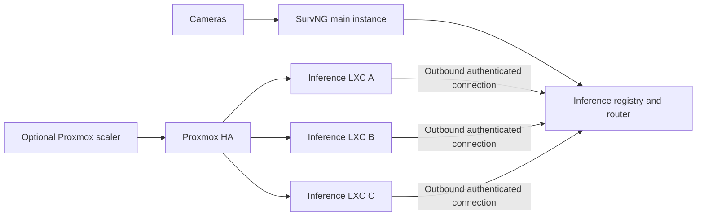

# Remote inference on Proxmox

Status: design accepted for incremental implementation. Milestone 1 is
implemented: `InferenceSupervisor` constructs execution slots through the
transport-neutral contracts in `inference_runtime/backend.py`. The repository
still runs inference locally; remote registration and transport are the next
milestone.

This document is the implementation handoff for moving SurvNG's model execution
to self-registering workers in Proxmox LXC guests. It records the intended
architecture, invariants, delivery order, and current code boundaries so work
can continue without reconstructing the design from conversation history.

## Goal

Keep camera ownership, capture, ONVIF subscriptions, recording, motion state,
incident state, tracking sessions, and SQLite storage in the existing SurvNG
instance. Move bounded model operations to a pool of accelerator-capable
workers:

- object detection;
- face detection and embedding;
- person and vehicle ReID embedding;
- depth estimation.

The first production milestone uses a fixed pool of Proxmox LXC workers.
Workers discover SurvNG by connecting outbound to a configured URL. A later
optional scaler may start and stop prepared containers through the Proxmox API.

## Non-goals

The initial implementation does not:

- distribute camera workers or recorders;
- share SQLite files between hosts;
- merge live tracking state across cameras;
- require Kubernetes, Redis, NATS, or a new database;
- expose inference workers directly to browsers;
- clone LXC guests in response to an incident;
- change detector output or use lossy transport compression.

## Deployment shape

Only the main SurvNG instance owns application state. Inference workers are
replaceable compute appliances. A worker may disappear at any point without
becoming an authority for incidents, identities, configuration, or media.

## Existing code boundaries

The implementation should preserve current callers while separating scheduling
from process transport:

- `survng/app/inference_runtime/supervisor.py`
  - owns workload admission, priority, failover, status aggregation, and role
    lifecycle;
  - exposes detection, face, ReID, depth, probe, and inspection operations.
- `survng/app/inference_runtime/worker.py`
  - owns one local multiprocessing child;
  - implements priority admission and the `request()` operation boundary.
- `survng/app/inference_runtime/process.py`
  - loads OpenVINO engines and dispatches worker operations.
- `survng/app/inference_runtime/adapters.py`
  - adapts the supervisor to face, appearance, and depth consumers.
- `survng/app/inference_lifecycle.py`
  - transactionally owns inference, tracking, face, and appearance services.
- `survng/app/config.py`
  - defines `DetectorConfig` and role-specific model/device settings.
- `survng/app/system_routes.py`
  - publishes detector and accelerator status.
- `frontend/src/admin/ConfigPage.jsx`
  - configures the detector and local worker count.

The first code milestone introduces a worker protocol/interface around the
methods already supplied by `_InferenceWorker`. Local execution must continue
to use the same implementation and pass the existing inference tests.

## Required invariants

### Security work remains protected

`InferenceWorkload` ordering is part of the runtime contract:

1. `INCIDENT_INITIAL`
2. `INCIDENT_REFINEMENT`
3. `INTERACTIVE`
4. `TRACKING`
5. `ENRICHMENT`
6. `OFFLINE`

Remote routing must not flatten these classes into a FIFO. At least one object
inference slot must remain available to initial incident work. Tracking,
enrichment, and offline jobs may be shed rather than queueing ahead of security
work.

### Deadlines are end-to-end

A request deadline begins before admission and covers:

- local queueing;
- network transfer;
- remote admission;
- model execution;
- response transfer.

Retries are permitted because inference operations are pure, but only while the
original deadline has useful time remaining. A timeout must not leave a worker
slot permanently occupied.

### Workers are fenced by connection generation

Every worker has a persistent random worker ID. Each accepted connection gets a
new server-side generation. Reconnection with the same worker ID immediately
fences the previous connection. Late responses from a fenced generation are
discarded.

### Models are generation-safe

Registration advertises model fingerprints and protocol capabilities. A
request names the required model generation or fingerprint. A worker with a
different model must not receive the request.

Workers load and warm models before advertising readiness. Configuration
rollout must retain the prior usable generation until the replacement is ready,
matching the existing transactional reconfiguration behavior.

### Local behavior remains available

Configuration eventually supports:

- `local`: current multiprocessing behavior;
- `remote`: remote pool only;
- `hybrid`: remote pool with bounded local fallback.

The recommended hybrid fallback applies only to initial incident detection.
Optional work should defer when remote capacity is unavailable instead of
overloading the local fallback device.

### Frames are validated and lossless

The first protocol carries contiguous `uint8` BGR bytes plus shape and byte
count. It retains `MAX_INFERENCE_FRAME_BYTES` and the current object-frame
downscaling/box-restoration behavior. Lossy JPEG or WebP transport is deferred
until detector parity is measured.

Depth metadata can contain PNG bytes, so protocol serialization must support
bounded binary response fields rather than assuming every result is plain JSON.

## Connection and protocol

The preferred transport is a persistent outbound WebSocket from each worker to
the main SurvNG process. This avoids per-worker inbound firewall rules and
self-advertised URLs.

### Registration

The worker sends:

- protocol version;
- stable worker ID and human-readable name;
- worker software version;
- available roles and slot count;
- device names;
- maximum frame size;
- active model generation and per-role fingerprints;
- readiness and warmup status.

The server replies with:

- accepted protocol version;
- connection generation;
- heartbeat interval and lease duration;
- active configuration/model generation;
- role admission policy.

### Requests

A request envelope contains:

- request ID;
- connection generation;
- operation;
- `InferenceWorkload`;
- absolute deadline;
- required model fingerprint;
- frame shape, dtype, and byte count;
- operation-specific arguments;
- raw frame bytes when required.

Responses contain:

- request ID and connection generation;
- success, unavailable, deferred, or error status;
- operation result;
- queue, transfer, and execution timing;
- bounded diagnostic error text.

The protocol must reject unknown operations, unsupported versions, invalid
shapes, oversized frames, non-finite arguments, and responses that do not match
the active request generation.

### Authentication

Use a dedicated inference-worker credential, not a general administrator API
token. Store only its digest in SurvNG configuration and reveal the generated
secret once. Require TLS except for an explicit development-only loopback mode.

Worker credentials authorize registration and inference transport only. They
must not grant access to camera configuration, events, recordings, or other
administrative APIs.

## Routing and discovery

The main process owns an in-memory worker registry. It tracks:

- connection generation and lease expiry;
- role/model compatibility;
- ready and draining state;
- pending and active requests;
- queue delay and inference latency;
- recent transport failures.

Workers renew leases with heartbeats. Expired connections leave routing
immediately. Workers automatically reconnect after either side restarts using
bounded exponential backoff with jitter.

Selection is pressure-aware and rotates equal-load workers fairly. Initial
incident requests can quickly fail over to another compatible worker. Lower
priority work must not use a slot reserved for initial incident detection.

## Proxmox appliance

The supported first deployment is one unprivileged Debian or Ubuntu LXC guest
per accelerator-capable node:

- OpenVINO and SurvNG worker code installed in a virtual environment;
- models mounted or copied at consistent `/models/...` paths;
- `/dev/dri/renderD128` passed through;
- host render group mapped into the guest;
- bridged private network;
- worker managed by systemd;
- stable worker ID under `/var/lib/survng-inference`;
- configuration under `/etc/survng-inference`.

GPU-bound containers belong to a Proxmox HA group restricted to compatible
nodes. Live migration is not assumed to preserve active accelerator work.

## Optional Proxmox scaler

Automatic instantiation is a separate milestone. Prefer prepared, stopped LXC
guests tagged `survng-inference` over cloning during an incident.

The scaler uses a least-privilege Proxmox API token and:

- starts a prepared guest after sustained queue or admission-delay pressure;
- waits for registration, model validation, and warmup before counting capacity;
- keeps at least one warm incident-capable spare;
- marks a worker draining before stopping it;
- never stops the final incident-capable worker;
- applies minimum-runtime and cooldown windows;
- limits placement to nodes with a compatible accelerator.

Proxmox HA restarts existing guests. The scaler only changes the desired number
of prepared guests that are running.

## Delivery milestones

### Milestone 1: local backend boundary

- Define the worker/backend protocol used by `InferenceSupervisor`.
- Adapt `_InferenceWorker` without changing behavior.
- Keep configuration and runtime local-only.
- Add contract tests and run the existing inference lifecycle suite.

### Milestone 2: remote protocol and registry

- Add protocol envelopes and bounded binary serialization.
- Add authenticated worker registration, heartbeats, leases, and fencing.
- Add a fake worker integration harness.
- Exercise failure, reconnect, timeout, and priority behavior.

### Milestone 3: worker daemon

- Add the worker entry point and role dispatch.
- Reuse existing OpenVINO engine loading and operation implementations.
- Add model warmup and fingerprint reporting.
- Package a systemd service and health command.

### Milestone 4: runtime integration

- Add local, remote, and hybrid modes.
- Add remote object, face, ReID, and depth routing.
- Implement incident-only local fallback.
- Preserve transactional role reconfiguration.

### Milestone 5: operations

- Add worker inventory and queue/latency telemetry.
- Add admin configuration and one-time credential generation.
- Document and validate the Proxmox LXC template.
- Run multi-node failure and latency testing.

### Milestone 6: Proxmox scaler

- Manage prepared guests by tag through the Proxmox API.
- Implement pressure thresholds, warm spare, draining, and cooldown.
- Add audit events and scaler health telemetry.

## Test and acceptance matrix

Automated coverage must include:

- local backend contract parity;
- protocol round trips for every operation;
- binary depth heatmap metadata;
- malformed and oversized frames;
- unauthorized and duplicate worker connections;
- lease expiry and reconnect fencing;
- model-generation mismatch;
- workload ordering and reserved incident capacity;
- timeout, cancellation, late response, and fast failover;
- local fallback policy;
- main-process and worker-process restart recovery;
- status aggregation with partial role availability.

Before enabling remote initial detection, validate on at least two Proxmox
nodes:

- local and remote results match for the same raw frames;
- end-to-end latency remains inside existing request deadlines;
- stopping a worker does not block later incident requests;
- restarting SurvNG causes workers to reconnect without manual discovery;
- stale or mismatched workers receive no production traffic;
- optional workloads cannot starve initial incident detection.

## Implementation notes for the next contributor

Start at Milestone 1. Avoid adding remote networking directly to camera,
tracking, face, or depth consumers. Their stable boundary is
`InferenceSupervisor`.

Keep admission and workload policy in the main process. A worker may enforce an
additional local priority queue, but it must not become the only place where
security work is protected.

Do not put SQLite, event state, or media ownership in the worker daemon. Do not
introduce Proxmox API credentials into the main inference transport. The
optional scaler is an independently permissioned service.

When this document and the implementation differ, update this document in the
same pull request and record the reason in the commit message or PR description.
